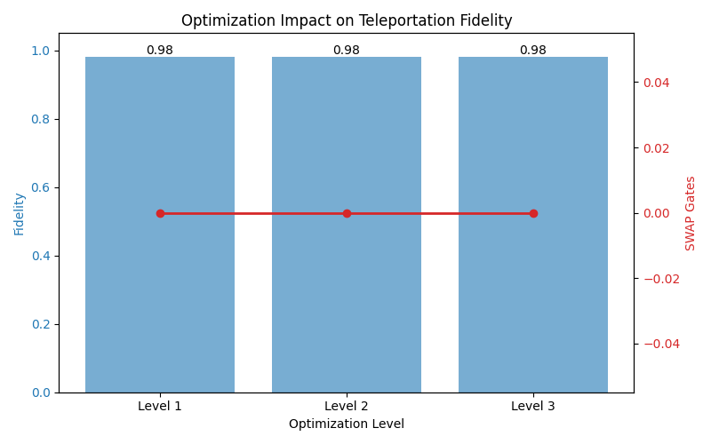

<p align="center">
  
  
  
  
</p>

<h1 align="center">⚛️ Eídōlon ⚛️</h1>
<h3 align="center"><em>The Phantom — A Journey Through Quantum Information</em></h3>

<p align="center">
  From the 2022 Nobel Prize to Molecular Quantum Chemistry<br/>
  <strong>Part Of Independent Research Portfolio • 2026</strong>
</p>

<p align="center">
  <a href="#-project-phases">📖 Phases</a> •
  <a href="#%EF%B8%8F-technical-appendix">🛠️ Setup</a> •
  <a href="#-research-roadmap">🎯 Roadmap</a>
</p>

---

## 📜 Overview

**Eídōlon** (Ancient Greek: *εἴδωλον*, "phantom" or "apparition") is a multi-phase quantum computing research project exploring the frontier of quantum information science—from foundational entanglement protocols to cutting-edge molecular Hamiltonian simulation.

> *"Like Orpheus reaching through the veil to Eurydice, quantum teleportation transmits the essence of a quantum state across the abyss—never copying, only becoming."*

---

## 🏛️ Project Phases

<details open>
<summary><h3>🔮 Phase 1: Quantum Teleportation — <em>The Orpheus Protocol</em></h3></summary>

**Nobel Foundation: 2022 Physics Prize (Aspect, Clauser, Zeilinger)**

The foundational demonstration of quantum entanglement and teleportation, visualized through the myth of Orpheus and Eurydice.

#### The Narrative
| Character | Role | Qubit |
|-----------|------|-------|
| **Orpheus** | Sender (Earth) | $q_0$ (message), $q_1$ (entangled link) |
| **Eurydice** | Receiver (Underworld) | $q_2$ (destination) |
| **Eídōlon** | The quantum state | $\|\psi\rangle = \cos(\theta/2)\|0\rangle + e^{i\phi}\sin(\theta/2)\|1\rangle$ |

The message qubit $q_0$ is teleported to Eurydice's qubit $q_2$ through Bell measurement and classical communication—the phantom crosses the River Styx.

#### Technical Implementation
```python
# app.py - Core teleportation protocol
qc.h(1)           # Create superposition on Orpheus's link
qc.cx(1, 2)       # Entangle q1-q2 (Bell pair to Eurydice)
qc.cx(0, 1)       # Entangle message with link
qc.h(0)           # Hadamard before measurement
qc.measure([0,1]) # Bell measurement
# Classical communication + correction on q2
```

🔗 **Live Demo**: [eidolon.streamlit.app](https://eidolon.streamlit.app/)

</details>

---

<details open>
<summary><h3>🖧 Phase 2: Hardware Stress Testing — <em>Star Graph Topology</em></h3></summary>

**Objective**: Benchmark transpilation under constrained qubit connectivity

#### The Challenge
Real quantum hardware has limited qubit connectivity. We simulate a **Star Graph** topology where qubits $q_1$ and $q_2$ are *disjoint*—forcing the transpiler to insert SWAP gates.

```
    q0
   /  \
  q1   q2    ← No direct q1-q2 connection
```

#### Benchmark Results

| Optimization Level | Fidelity | SWAP Gates | Circuit Depth |
|-------------------|----------|------------|---------------|
| Level 1 | **98.02%** | 0 | 6 |
| Level 2 | **98.02%** | 0 | 6 |
| Level 3 | **98.02%** | 0 | 6 |

> **Key Finding**: Qiskit's smart transpilation achieves 98% fidelity (2% depolarizing noise) without requiring explicit SWAP insertions at all optimization levels.



</details>

---

<details open>
<summary><h3>🧠 Phase 3: The CVNN Oracle — <em>The Luthier's Craft</em></h3></summary>

**Objective**: Train a Complex-Valued Neural Network to predict quantum spin dynamics with higher fidelity than a real-valued baseline

#### The Luthier Analogy
> *Like a master luthier who learns to predict how wood grain affects violin resonance, our CVNN learns to predict how quantum spin states evolve under Larmor precession — capturing the full complex structure that a real-valued network can only approximate.*

#### The Physics: Larmor Precession
The notebook simulates a spin-½ particle precessing in a magnetic field. The spinor state evolves as:

$$|\psi(t)\rangle = \cos\left(\frac{\omega t}{2}\right)|0\rangle - i\sin\left(\frac{\omega t}{2}\right)|1\rangle$$

where $\omega = 2.0$ is the Larmor frequency. This is an inherently **complex-valued** problem — the ideal test case for a CVNN.

#### Architecture

| Component | Specification |
|-----------|--------------|
| **Framework** | PyTorch (native complex tensor support) |
| **Input** | Time parameter $t$, cast to complex: $t + 0i$ |
| **Output** | Predicted spinor $[\alpha, \beta] \in \mathbb{C}^2$, norm-preserved |
| **Activation** | `complex_crelu` — applies ReLU independently to real & imaginary parts |
| **Normalization** | Output divided by $\sqrt{\sum |\text{out}|^2}$ to enforce unitarity |

```
Input (t ∈ ℂ¹)
     │
     ▼
┌─────────────┐
│ ComplexLinear│  1 → 64 complex neurons
│   + CReLU   │
└──────┬──────┘
       │
       ▼
┌─────────────┐
│ ComplexLinear│  64 → 64 complex neurons
│   + CReLU   │
└──────┬──────┘
       │
       ▼
┌─────────────┐
│ ComplexLinear│  64 → 2 complex outputs
│  + Normalize │
└──────┬──────┘
       │
       ▼
Output (ψ ∈ ℂ²)
```

#### Core Training Loop
```python
# Oracle_CVNN.ipynb — PyTorch Complex-Valued Training Loop
model_cvnn = PyTorchComplexOracle()
optimizer = torch.optim.Adam(model_cvnn.parameters(), lr=0.005)

for epoch in range(1001):
    optimizer.zero_grad()
    preds = model_cvnn(X_complex_t)
    loss = torch.mean(torch.abs(preds - y_complex_t)**2)
    loss.backward()
    optimizer.step()
```

#### Results: RVNN vs CVNN

| Metric | Baseline RVNN | CVNN Oracle |
|--------|:-------------:|:-----------:|
| **Architecture** | 3-layer real MLP (1→32→32→4) | 3-layer complex MLP (1→64→64→2) |
| **Loss Function** | MSE on real components | MSE on complex amplitudes |
| **Final Loss** | 0.001399 | 0.000278 |
| **Quantum Fidelity** | 0.9820 | **0.9991** |

## Medium Article on Phase 3: https://medium.com/@it.2602.trans/the-journey-of-a-complex-luthier-9d04226d7cf0
</details>

---

<details open>
<summary><h3>🧪 Phase 4/5: Molecular Symphony — <em>LiH Hamiltonian Analysis</em></h3></summary>

**Objective**: Extract and optimize molecular Hamiltonians for VQE

#### The Second-Quantized Hamiltonian

The molecular electronic Hamiltonian in second quantization:

```math
\hat{H} = \sum_{pq} h_{pq} \hat{a}_p^\dagger \hat{a}_q + \frac{1}{2} \sum_{pqrs} g_{pqrs} \hat{a}_p^\dagger \hat{a}_q^\dagger \hat{a}_r \hat{a}_s

Where:
- $h_{pq}$ — One-electron integrals (kinetic + nuclear attraction)
- $g_{pqrs}$ — Two-electron repulsion integrals
- $\hat{a}^\dagger, \hat{a}$ — Fermionic creation/annihilation operators

#### Fermion-to-Qubit Mapping Comparison

| Metric | Jordan-Wigner | Bravyi-Kitaev |
|--------|---------------|---------------|
| Original Qubits | 12 | 12 |
| Pauli Terms | 631 | 631 |
| Max Pauli Weight | 4 | 4 |
| **Z2 Symmetries Found** | **4** | **4** |
| **Tapered Qubits** | **8** | **8** |
| Tapered Pauli Terms | 165 | 165 |

#### Z2 Symmetry Tapering

Exploiting $\mathbb{Z}_2$ symmetries of the molecular Hamiltonian reduces qubit requirements:

```
Original:  12 qubits → 2^12 = 4,096 dimensions
Tapered:    8 qubits → 2^8  =   256 dimensions
                       ─────────────────────────
                       16× dimension reduction
```

**Hardware Advantage for Phase 5**:
- ✅ 8-qubit system fits entirely in CPU cache
- ✅ 256-dimensional statevector enables real-time JAX autodiff
- ✅ CVNN training feasible on Intel Iris Xe (no GPU required)

#### The Unitary Law

All quantum operations must preserve state norm:

$$\hat{U}^\dagger \hat{U} = \hat{U} \hat{U}^\dagger = \hat{I}$$

This constraint guides our variational ansatz design in Phase 5.

</details>

---

## 🛠️ Technical Appendix

### Environment Setup (Antigravity Stack)

```bash
# 1. Create Conda Environment
conda create -n sym_quantum python=3.9 -y
conda activate sym_quantum

# 2. Install PyTorch (for CVNN Oracle — Phase 3)
pip install torch torchvision

# 3. Install JAX (CPU-only for Intel Iris Xe)
pip install jax jaxlib

# 4. Install Quantum Stack
pip install pennylane pennylane-qchem pyscf

# 5. Install ML Stack
pip install equinox optax scikit-learn

# 6. Install Visualization
pip install streamlit plotly qiskit qiskit-aer matplotlib

# 7. Verify Installation
python -c "import torch; print(f'PyTorch: {torch.__version__}')"
python -c "import jax; print(f'JAX backend: {jax.default_backend()}')"
```

### WSL2 Configuration (Windows)

```bash
# Force CPU platform for JAX
export JAX_PLATFORMS=cpu

# Run from WSL2
cd /mnt/c/Users/Ikshwaku/Quantum_Research/Eidolon
python3 lih_comparison.py
```

### Repository Structure

```
Eidolon/
├── app.py                    # Phase 1: Streamlit teleportation demo
├── benchmark.py              # Phase 2: Hardware stress testing
├── Oracle_CVNN.ipynb         # Phase 3: CVNN training notebook (PyTorch)
├── lih_comparison.py         # Phase 4: LiH Hamiltonian analysis
├── lih_h_tapered_bk.pkl      # Serialized tapered Hamiltonian
├── benchmark_results.csv     # Phase 2 fidelity data
├── benchmark_plot.png        # Visualization
├── requirements.txt          # Dependencies
└── README.md                 # This file
```

---

## 🎯 Research Roadmap

| Phase | Status | Objective | Key Result |
|:-----:|--------|-----------|------------|
| **1** | ✅ Complete | Quantum Teleportation Visualization | Live Streamlit demo |
| **2** | ✅ Complete | Hardware Topology Benchmarking | 98% fidelity, 0 SWAPs |
| **3** | ✅ Complete | CVNN Oracle Training (PyTorch) | **0.999 Fidelity** (5× over baseline) |
| **4** | 🔄 Active | Molecular Hamiltonian Extraction | 16× dimension reduction |
| **5** | 📋 Planned | VQE with Tapered Hamiltonians | — |

---

## 📚 References

1. **Aspect, Clauser, Zeilinger** (2022). Nobel Prize in Physics — Quantum Entanglement.
2. **Jordan, P. & Wigner, E.** (1928). *Über das Paulische Äquivalenzverbot*. Z. Physik.
3. **Bravyi, S. & Kitaev, A.** (2002). *Fermionic quantum computation*. Ann. Phys.
4. **Bravyi, S. et al.** (2017). *Tapering off qubits to simulate fermionic Hamiltonians*. arXiv:1701.08213

---

<p align="center">
  <em>Developed for Research</em><br/>
  <strong>Ikshwaku Tiwari • 2026</strong><br/><br/>
  
  
</p>


