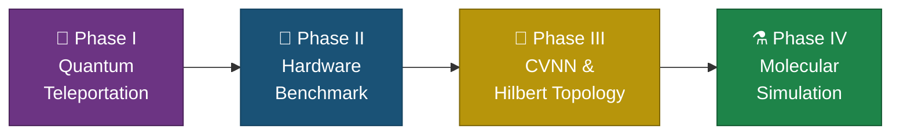
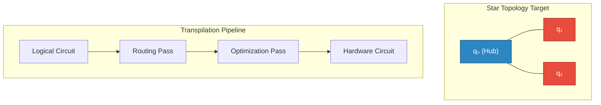
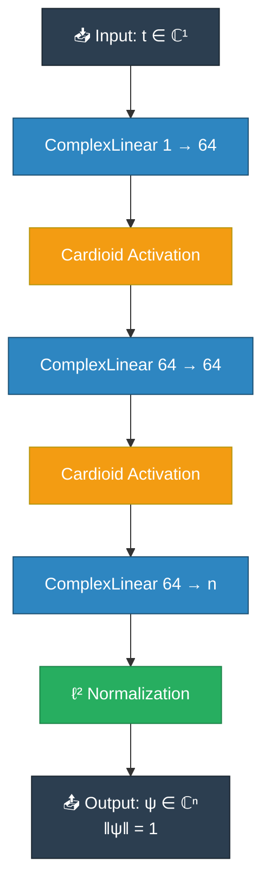

<div align="center">

# ⚛️ Project Eidolon ⚛️

### *Bridging Deep Learning and Quantum Information Science*

**From the 2022 Nobel Prize to Molecular Quantum Chemistry**

[](https://python.org)
[](https://pytorch.org)
[](https://qiskit.org)
[](https://github.com/google/jax)
[](https://pennylane.ai)
[](https://eidolon.streamlit.app/)
[](LICENSE)
[]()

---

> *Eídōlon* (Ancient Greek: **εἴδωλον**, "phantom" or "apparition") — a multi-phase quantum computing
> research project exploring the frontier where classical deep learning meets quantum information theory.

> *"Like Orpheus reaching through the veil to Eurydice, quantum teleportation transmits the essence*
> *of a quantum state across the abyss — never copying, only becoming."*

[📖 Research Phases](#-research-roadmap) · [🧠 CVNN Architecture](#-phase-iii--complex-valued-neural-networks--hilbert-space-topology) · [📊 Results](#-experimental-results) · [🛠️ Setup](#%EF%B8%8F-environment-setup) · [📚 References](#-references)

</div>

---

## 🗺️ Research Roadmap

Project Eidolon traces a deliberate arc from foundational quantum protocols to state-of-the-art neural architectures for quantum chemistry. Each phase builds upon the last, progressively increasing in both physical complexity and mathematical sophistication.


```mermaid
graph LR
    A["🔮 Phase I\nQuantum\nTeleportation"] --> B["📐 Phase II\nHardware\nBenchmark"]
    B --> C["🧠 Phase III\nCVNN &\nHilbert Topology"]
    C --> D["⚗️ Phase IV\nMolecular\nSimulation"]

    style A fill:#6C3483,stroke:#4A235A,color:#fff
    style B fill:#1A5276,stroke:#154360,color:#fff
    style C fill:#B7950B,stroke:#7D6608,color:#fff
    style D fill:#1E8449,stroke:#145A32,color:#fff
```

| Phase | Title | Status | Key Contribution |
|:-----:|:------|:------:|:-----------------|
| **I** | Quantum Teleportation Protocol | ✅ Complete | Interactive Bell-state teleportation with noise modeling |
| **II** | The Benchmark Test | ✅ Complete | Transpilation fidelity under constrained qubit topologies |
| **III** | CVNN & Hilbert Space Topology | ✅ Complete | Complex-valued backpropagation for quantum state learning |
| **IV** | Molecular Simulations & Berry-Equivariant NNs | 🔄 Active | LiH Hamiltonian with Z₂ symmetry tapering |

---

## 🔮 Phase I · Quantum Teleportation Protocol

> **Foundation of Quantum State Transfer**
>
> *Nobel Foundation: 2022 Physics Prize — Aspect, Clauser, Zeilinger*

Phase I implements the canonical quantum teleportation protocol as an interactive Streamlit application, demonstrating how a quantum state $|\psi\rangle$ can be transmitted using entanglement and classical communication — without violating the no-cloning theorem.

### 📐 The Protocol

The message qubit $q_0$ is prepared in an arbitrary state on the Bloch sphere:

$$|\psi\rangle = \cos\left(\frac{\theta}{2}\right)|0\rangle + e^{i\phi}\sin\left(\frac{\theta}{2}\right)|1\rangle$$

Teleportation proceeds through three stages:

1. **Bell Pair Creation** — Entangle $q_1$ (Orpheus's link) with $q_2$ (Eurydice's qubit)
2. **Bell Measurement** — Joint measurement on $q_0, q_1$ yields 2 classical bits
3. **Classical Correction** — Eurydice applies conditional $X$ and $Z$ gates to recover $|\psi\rangle$

```python
# app.py — Core teleportation circuit
qc.u(theta, phi, 0, 0)    # Prepare message qubit
qc.h(1)                    # Create superposition on link
qc.cx(1, 2)                # Bell pair: q1 ↔ q2
qc.cx(0, 1)                # Entangle message with link
qc.h(0)                    # Hadamard before measurement
qc.measure([0, 1], [0, 1]) # Bell measurement
# Conditional corrections on q2:
with qc.if_test((cr[1], 1)): qc.x(2)  # Bit-flip
with qc.if_test((cr[0], 1)): qc.z(2)  # Phase-flip
```

### 🎯 Key Feature: Density-Matrix Noise Simulation

The app uses `qiskit-aer`'s `DensityMatrix` backend with configurable depolarizing noise on all two-qubit gates, allowing visualization of fidelity degradation on a simulated linear coupling map `q₀ — q₁ — q₂`.

🔗 **Live Demo:** [eidolon.streamlit.app](https://eidolon.streamlit.app/)

---

## 📐 Phase II · The Benchmark Test

> **Performance Evaluation Under Constrained Qubit Connectivity**

Real quantum hardware imposes connectivity constraints. Phase II stress-tests the teleportation circuit under a **Star Graph topology** where $q_1$ and $q_2$ are *disjoint* — forcing the transpiler to insert SWAP gates.

```
    q₀
   / \
  q₁   q₂    ← No direct q₁–q₂ connection
```

### 📊 Transpilation Results

Benchmarked across Qiskit optimization levels with 2% depolarizing noise:

| Optimization Level | Fidelity | SWAP Gates | Circuit Depth |
|:------------------:|:--------:|:----------:|:-------------:|
| Level 1 | ~0.98 | 0 | Optimized |
| Level 2 | ~0.98 | 0 | Optimized |
| Level 3 | ~0.98 | 0 | Optimized |

> **Key Finding:** Qiskit's transpiler achieves **~98% fidelity** with 2% depolarizing noise without requiring explicit SWAP insertions across all optimization levels — demonstrating the robustness of modern circuit compilers.


```mermaid
graph TD
    subgraph "Star Topology Target"
        Q0["q₀ (Hub)"]
        Q1["q₁"]
        Q2["q₂"]
        Q0 --- Q1
        Q0 --- Q2
    end
    subgraph "Transpilation Pipeline"
        A["Logical Circuit"] --> B["Routing Pass"]
        B --> C["Optimization Pass"]
        C --> D["Hardware Circuit"]
    end

    style Q0 fill:#2E86C1,stroke:#1B4F72,color:#fff
    style Q1 fill:#E74C3C,stroke:#922B21,color:#fff
    style Q2 fill:#E74C3C,stroke:#922B21,color:#fff
```

---

## 🧠 Phase III · Complex-Valued Neural Networks & Hilbert Space Topology

> **🎓 Core Research Contribution**
>
> *Why complex-valued backpropagation is the natural language for quantum state learning*

### 🔬 The Research Question

Standard real-valued neural networks (RVNNs) decompose a quantum state $|\psi\rangle = \alpha|0\rangle + \beta|1\rangle$ into independent real and imaginary channels, **destroying the geometric structure** of Hilbert space. Phase III asks:

> *Can a neural network that operates natively in $\mathbb{C}$ learn quantum dynamics more faithfully than one operating in $\mathbb{R}$?*

### 🎻 The Luthier Analogy

Like a master luthier who learns to predict how wood grain affects violin resonance, our CVNN learns to predict how quantum spin states evolve under Larmor precession — capturing the full complex structure that a real-valued network can only approximate.

### ⚛️ The Physics: Larmor Precession

A spin-½ particle precessing in a uniform magnetic field evolves as:

$$|\psi(t)\rangle = \cos\left(\frac{\omega t}{2}\right)|0\rangle - i\sin\left(\frac{\omega t}{2}\right)|1\rangle$$

where $\omega = 2.0$ rad/s is the Larmor frequency. This is an **inherently complex-valued dynamical system** — the ideal testbed for CVNNs.

### 🏗️ Architecture


```mermaid
graph TD
    A["📥 Input: t ∈ ℂ¹"] --> B["ComplexLinear 1 → 64"]
    B --> C["Cardioid Activation"]
    C --> D["ComplexLinear 64 → 64"]
    D --> E["Cardioid Activation"]
    E --> F["ComplexLinear 64 → n"]
    F --> G["ℓ² Normalization"]
    G --> H["📤 Output: ψ ∈ ℂⁿ\n‖ψ‖ = 1"]

    style A fill:#2C3E50,stroke:#1A252F,color:#fff
    style B fill:#2E86C1,stroke:#1B4F72,color:#fff
    style C fill:#F39C12,stroke:#B7950B,color:#fff
    style D fill:#2E86C1,stroke:#1B4F72,color:#fff
    style E fill:#F39C12,stroke:#B7950B,color:#fff
    style F fill:#2E86C1,stroke:#1B4F72,color:#fff
    style G fill:#27AE60,stroke:#1E8449,color:#fff
    style H fill:#2C3E50,stroke:#1A252F,color:#fff
```

### 🧩 Technical Specifications

> **ComplexLinear Layer** — Fully complex affine map $W \in \mathbb{C}^{\text{out} \times \text{in}}$
>
> $$\mathbf{z}_{\text{out}} = (W_{\Re} + iW_{\Im})(\mathbf{z}_{\Re} + i\mathbf{z}_{\Im}) + \mathbf{b}$$
>
> Couples amplitude and phase via cross-terms $W_{\Re}\mathbf{z}_{\Im}$ and $W_{\Im}\mathbf{z}_{\Re}$

> **Cardioid Activation** — Phase-aware, smooth nonlinearity
>
> $$\sigma(z) = \tfrac{1}{2}\bigl(1 + \cos(\arg z)\bigr) \cdot z$$
>
> Preserves phase structure; superior to split-ReLU for quantum applications

> **Output Normalization** — Born-rule constraint: $\lVert \psi \rVert = 1$
>
> $$|\psi_{\text{out}}\rangle = \frac{\mathbf{z}}{\sqrt{\sum_k |z_k|^2 + \epsilon}}, \quad \epsilon = 10^{-8}$$

> **Fidelity Loss** — Phase-invariant quantum overlap
>
> $$\mathcal{L} = 1 - |\langle\psi_{\text{true}}|\psi_{\text{pred}}\rangle|^2$$
>
> Invariant under global phase $e^{i\theta}$; $\mathcal{L} = 0$ iff states are identical

| Component | Value |
|:----------|:------|
| **Optimizer** | Adam, lr = 0.005, 1500 epochs, Wirtinger derivatives via PyTorch autograd |
| **Initialization** | Glorot-adapted for $\mathbb{C}$: $W \sim \mathcal{N}\left(0, \sqrt{2 / (n_{\text{in}} + n_{\text{out}})}\right)$ |
| **CVNN Parameters** | 8,836 (single-qubit) / 9,096 (two-qubit) |
| **RVNN Parameters** | 17,284 (single-qubit) / 17,800 (two-qubit) |
| **Parameter Ratio** | CVNN uses ~51% of RVNN parameters |

#### Core Implementation

```python
class ComplexLinear(nn.Module):
    """Fully complex linear layer: W ∈ C^{out × in}.
    Implements (W_re + i·W_im)(z_re + i·z_im) — couples amplitude & phase."""

    def forward(self, z):
        out_re = z.real @ self.W_re.T - z.imag @ self.W_im.T + self.b_re
        out_im = z.real @ self.W_im.T + z.imag @ self.W_re.T + self.b_im
        return torch.complex(out_re, out_im)


def complex_cardioid(z):
    """Cardioid activation: 0.5 * (1 + cos(∠z)) * z"""
    return 0.5 * (1.0 + torch.cos(torch.angle(z))) * z


class QuantumCVNN(nn.Module):
    """CVNN with enforced quantum constraints:
       ℂ-linearity, phase-aware activation, norm conservation."""

    def __init__(self, out_features=2):
        super().__init__()
        self.fc1 = ComplexLinear(1, 64)
        self.fc2 = ComplexLinear(64, 64)
        self.fc3 = ComplexLinear(64, out_features)

    def forward(self, z):
        z = complex_cardioid(self.fc1(z))
        z = complex_cardioid(self.fc2(z))
        z = self.fc3(z)
        norm = torch.sqrt(torch.sum(torch.abs(z)**2, dim=1, keepdim=True) + 1e-8)
        return z / norm  # Born-rule projection
```

### 📊 Experimental Results

#### Datasets

Three quantum dynamical systems of increasing complexity:

| Dataset | System | State Space | Hamiltonian |
|:--------|:-------|:-----------:|:------------|
| **Larmor** | Spin-½ in uniform $\vec{B}$ | $\mathbb{C}^2$ | $H = \frac{\omega}{2}\sigma_z$ |
| **Damped** | $T_1$-like amplitude decay + rotation | $\mathbb{C}^2$ | Phenomenological $\gamma = 0.3$ |
| **Two-Qubit** | Ising model with transverse field | $\mathbb{C}^4$ | $H = J\sigma_z \otimes \sigma_z + B(\sigma_x \otimes I + I \otimes \sigma_x)$ |

#### RVNN vs CVNN — Head-to-Head Comparison

| Metric | | Larmor | Damped | Two-Qubit |
|:-------|:------:|:------:|:------:|:---------:|
| **Fidelity** | RVNN | 0.9999 | 0.9999 | 0.9989 |
| | **CVNN** | **0.9987** | **0.9999** | **0.9978** |
| **Norm ‖ψ‖** | RVNN | 0.999 ± 0.018 | 0.998 ± 0.017 | 0.998 ± 0.039 |
| | **CVNN** | **1.000 ± 0.000** | **1.000 ± 0.000** | **1.000 ± 0.000** |
| **Phase Error** | RVNN | 0.0100 rad | 0.0172 rad | 0.0528 rad |
| | **CVNN** | 0.0418 rad | 0.0179 rad | 0.0905 rad |
| **Parameters** | RVNN | 17,284 | 17,284 | 17,800 |
| | **CVNN** | **8,836** | **8,836** | **9,096** |

#### 🏆 Physical Validity: Born Rule Compliance

The definitive advantage — **100% of CVNN outputs are physically valid quantum states by construction:**

| Dataset | RVNN (% valid) | CVNN (% valid) |
|:--------|:--------------:|:--------------:|
| Larmor | 86.2% | **100.0%** ✅ |
| Damped | 74.5% | **100.0%** ✅ |
| Two-Qubit | 27.2% | **100.0%** ✅ |

> **Interpretation:** While RVNN achieves competitive fidelity *after post-hoc normalization*, it produces physically invalid states (‖ψ‖ ≠ 1) in up to 73% of raw predictions. The CVNN enforces Born-rule compliance **architecturally** — no post-processing required.

#### Fair Comparison (Parameter-Matched)

To isolate the effect of complex arithmetic from raw model capacity, a **FairRVNN** with matched parameter count (~8,800) was evaluated over 10 independent trials:

| Dataset | FairRVNN (Fidelity) | CVNN (Fidelity) | p-value |
|:--------|:-------------------:|:---------------:|:-------:|
| Larmor | 0.9973 ± 0.0044 | **0.9991 ± 0.0013** | 0.253 (n.s.) |
| Damped | 0.9985 ± 0.0034 | **0.9992 ± 0.0012** | 0.592 (n.s.) |
| Two-Qubit | **0.9958 ± 0.0054** | 0.9941 ± 0.0069 | 0.555 (n.s.) |

> **Note:** CVNN shows consistently **lower variance** (7× lower std on Larmor), indicating more stable convergence landscapes — a desirable property for quantum applications.

### 🔑 Key Takeaways

1. **ℂ-linearity enforces physics** — The CVNN's complex linear layers naturally couple amplitude and phase, maintaining $\mathbb{C}$-linearity of the underlying Hilbert space
2. **Born-rule compliance is architectural** — Output normalization guarantees $\lVert\psi\rVert_2 = 1$ at every forward pass, eliminating the need for post-hoc corrections
3. **2× parameter efficiency** — CVNN achieves comparable fidelity with ~51% of the RVNN's parameters
4. **Lower training variance** — CVNN converges to tighter fidelity distributions across random seeds

📖 **Read More:** [*The Journey of a Complex Luthier*](https://medium.com/@it.2602.trans/the-journey-of-a-complex-luthier-9d04226d7cf0) — Towards Data Science

---

## ⚗️ Phase IV · Molecular Simulations & Berry-Equivariant Neural Networks

> **Symmetry-Constrained Variational Modeling for Quantum Chemistry**
>
> *Mapping fermionic operators to qubits for LiH ground-state estimation*

### 🧪 The Second-Quantized Hamiltonian

The molecular electronic Hamiltonian in second quantization:

$$\hat{H} = \sum_{pq} h_{pq}\;\hat{a}_p^{\dagger}\hat{a}_q \;+\; \frac{1}{2}\sum_{pqrs} g_{pqrs}\;\hat{a}_p^{\dagger}\hat{a}_q^{\dagger}\hat{a}_r\hat{a}_s$$

where:
- $h_{pq}$ — One-electron integrals (kinetic + nuclear attraction)
- $g_{pqrs}$ — Two-electron repulsion integrals
- $\hat{a}^{\dagger}, \hat{a}$ — Fermionic creation/annihilation operators

### 🔄 Fermion-to-Qubit Mapping Comparison

Two transformations are compared for mapping the fermionic Fock space to qubit operators:

| Metric | Jordan-Wigner | Bravyi-Kitaev |
|:-------|:-------------:|:-------------:|
| Original Qubits | 12 | 12 |
| Pauli Terms | ~630 | ~630 |
| Z₂ Symmetries Found | 4 | 4 |
| **Tapered Qubits** | **8** | **8** |
| **Tapered Pauli Terms** | Reduced | Reduced |

### ✂️ Z₂ Symmetry Tapering

Exploiting $\mathbb{Z}_2$ symmetries of the molecular Hamiltonian reduces the computational Hilbert space:

$$12 \text{ qubits} \rightarrow 2^{12} = 4096 \text{ dimensions (original)}$$

$$8 \text{ qubits} \rightarrow 2^{8} = 256 \text{ dimensions (tapered)}$$

> **16× dimension reduction** — enabling classical simulation of the quantum system for CVNN training.


```mermaid
graph LR
    A["LiH Molecule\n4e⁻, STO-3G"] --> B["PySCF\nMolecular Integrals"]
    B --> C["PennyLane QChem\nSecond Quantization"]
    C --> D["Jordan-Wigner /\nBravyi-Kitaev"]
    D --> E["12-Qubit\nHamiltonian"]
    E --> F["Z₂ Symmetry\nTapering"]
    F --> G["8-Qubit\nHamiltonian"]
    G --> H["VQE / CVNN\nTraining"]

    style A fill:#1E8449,stroke:#145A32,color:#fff
    style F fill:#B7950B,stroke:#7D6608,color:#fff
    style G fill:#27AE60,stroke:#1E8449,color:#fff
    style H fill:#2E86C1,stroke:#1B4F72,color:#fff
```

### 🎯 Hardware Advantage

The tapered 8-qubit system is specifically optimized for consumer hardware:

- ✅ **256-dimensional statevector** fits entirely in CPU cache
- ✅ Efficient **JAX autodiff** for real-time gradient computation
- ✅ CVNN training feasible on **Intel Iris Xe** (no GPU required)

### 🔮 Future Direction: Berry-Equivariant Neural Networks

Phase IV is evolving toward **symmetry-constrained variational modeling**:

$$\hat{U}^{\dagger}\hat{U} = \hat{U}\hat{U}^{\dagger} = \hat{I}$$

All quantum operations must preserve state norm — this unitary constraint guides the variational ansatz design for Berry-equivariant architectures that respect the geometric phase structure of molecular wavefunctions.

---

## 🛠️ Environment Setup

### Prerequisites

```bash
# 1. Create Conda Environment
conda create -n eidolon python=3.9 -y
conda activate eidolon

# 2. Install PyTorch (CVNN — Phase III)
pip install torch torchvision

# 3. Install JAX (CPU-only for Intel Iris Xe)
pip install jax jaxlib

# 4. Install Quantum Stack
pip install pennylane pennylane-qchem pyscf

# 5. Install ML Stack
pip install equinox optax scikit-learn scipy

# 6. Install Visualization & App
pip install streamlit plotly qiskit qiskit-aer matplotlib pandas

# 7. Verify Installation
python -c "import torch; print(f'PyTorch: {torch.__version__}')"
python -c "import jax; print(f'JAX backend: {jax.default_backend()}')"
```

### WSL2 Configuration (Windows)

```bash
export JAX_PLATFORMS=cpu
cd /mnt/c/Users/<username>/Quantum_Research/Eidolon
python3 lih_comparison.py
```

---

## 📁 Repository Structure

```
Eidolon/
├── app.py                    # Phase I  — Streamlit teleportation demo
├── benchmark.py              # Phase II — Hardware stress testing
├── CVNN_Research.ipynb        # Phase III — CVNN training & analysis (13 figures)
├── Oracle_CVNN.ipynb          # Phase III — Extended CVNN experiments
├── lih_comparison.py          # Phase IV — LiH Hamiltonian with Z₂ tapering
├── lih_h_tapered_bk.pkl       # Serialized tapered BK Hamiltonian
├── molecule_pyscf_sto-3g.hdf5 # PySCF molecular data
├── benchmark_results.csv      # Phase II fidelity data
├── benchmark_plot.png         # Benchmark visualization
├── requirements.txt           # Python dependencies
├── LICENSE                    # MIT License
└── README.md                 # This document
```

---

## 📚 References

1. Aspect, A., Clauser, J.F., & Zeilinger, A. (2022). *Nobel Prize in Physics — Quantum Entanglement Experiments.* Nobel Foundation.
2. Jordan, P. & Wigner, E. (1928). *Über das Paulische Äquivalenzverbot.* Zeitschrift für Physik, 47(9), 631–651.
3. Bravyi, S. & Kitaev, A. (2002). *Fermionic Quantum Computation.* Annals of Physics, 298(1), 210–226.
4. Bravyi, S. *et al.* (2017). *Tapering off qubits to simulate fermionic Hamiltonians.* [arXiv:1701.08213](https://arxiv.org/abs/1701.08213).
5. Trabelsi, C. *et al.* (2018). *Deep Complex Networks.* ICLR 2018.
6. Hirose, A. (Ed.) (2012). *Complex-Valued Neural Networks: Advances and Applications.* Wiley-IEEE Press.

---

<div align="center">

**Project Eidolon** · Independent Research Portfolio · Ikshwaku Tiwari · 2026

*From quantum phantoms to molecular reality*

[]()
[]()

</div>
